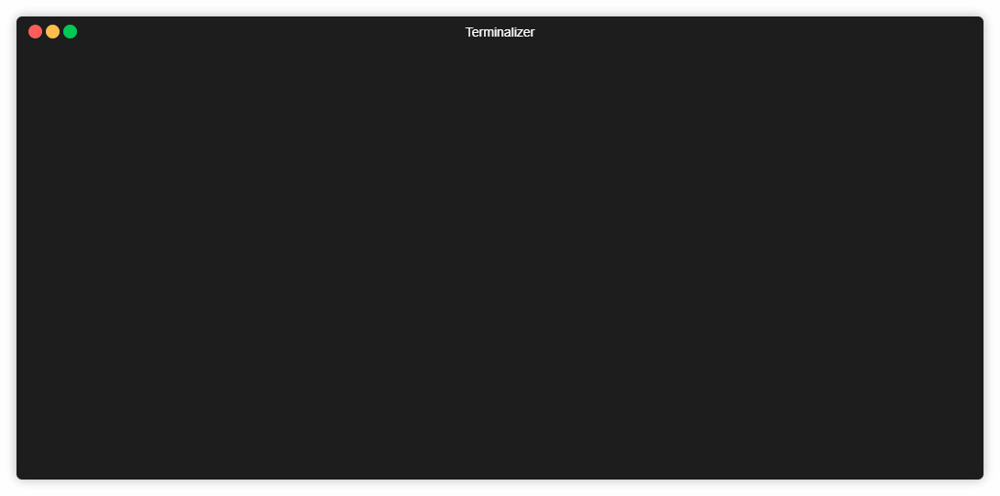
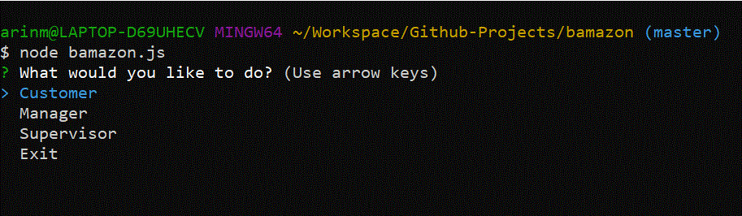
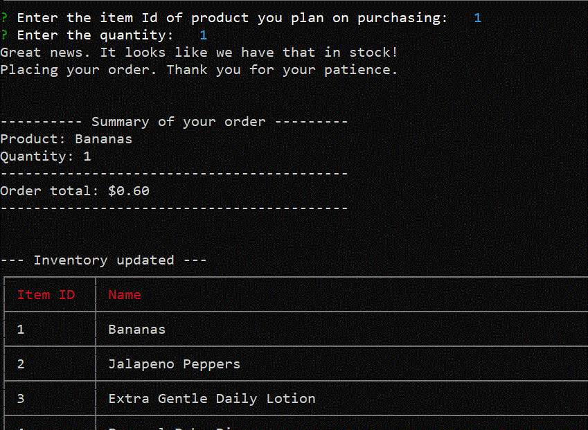
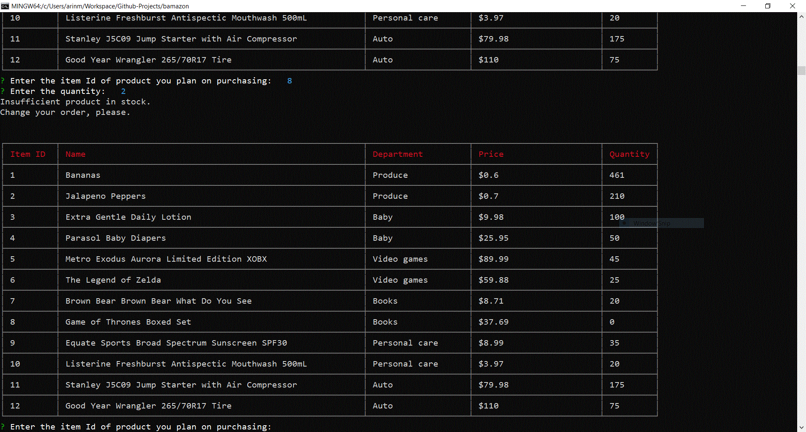
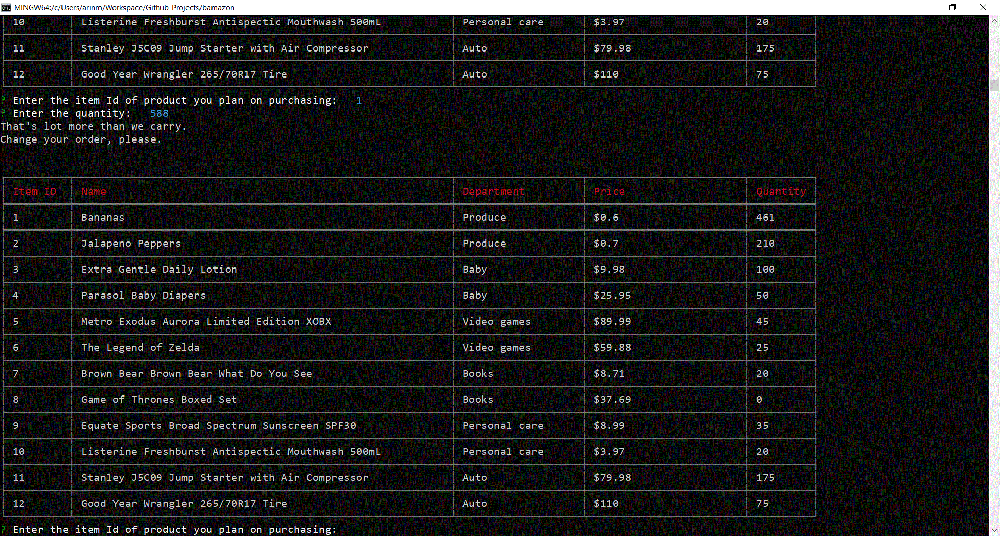
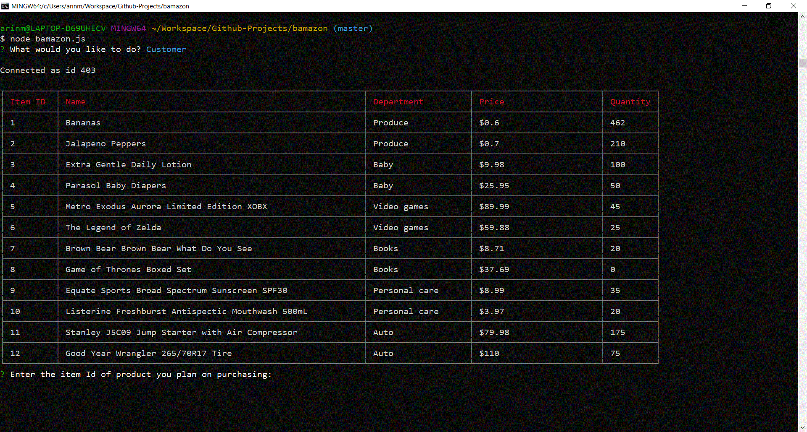

# Bamazon

## Description

This application implements a simple command line based storefront using the npm  [inquirer](https://www.npmjs.com/package/inquirer)  package and the MySQL database backend together with the npm  [mysql](https://www.npmjs.com/package/mysql)  package. As the writing of README document, the application presents one interface:  **customer**. Plan is to add **manager** and **supervisor** levels in future.

###  Before running the app
First, MySQL Database Setup

In order to run this application, you should have the MySQL database already set up on your machine. If you don't currently have it, visit the  [MySQL installation page](https://dev.mysql.com/doc/refman/5.6/en/installing.html)  to install latest version. Once you have MySQL isntalled, you will be able to create the  Bamazon database and the prodcuts table. You will be running this code inside your MySQL client.

Second, Create a file named ".env" and make sure you have the following code inside it (without the ' ' :

```
SQL_PWD = 'YOUR-SQL-PASSWORD'
```
Third, we are assuming you have the node.js installed. If you don't have it, visit  [Node's official site] (https://nodejs.org/en/)  on how to install it. It's important because you will be able to install the dependencies for npm. Type "npm i" to get all the dependencies.

### Customer Interface

The customer interface allows the user to view the current inventory of products the store currently has in stock. The user is then able to purchase one of the existing items by entering the item ID and the desired quantity. 

To run the customer interface please follow the steps below:

```
git clone git@github.com:arinmsn/Bamazon.git
cd bamazon
npm install
node bamazon.js

```

### Bamazon Demo



### Screenshots










